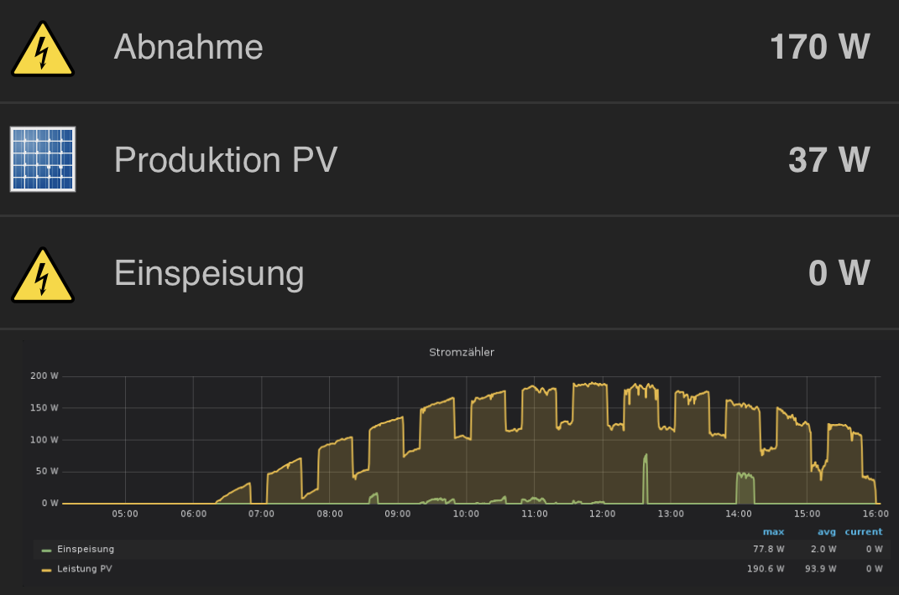

# Sync your consumption data from inofficial Fresh Energy API to an MQTT broker and use it e.g for openHAB

## Requirements
The add is using mqtt to populate readings from your smart meter. Therefore you need to install the mqtt broker first.
> sudo apt-get install -y mosquitto mosquitto-clients
> systemctl enable mosquitto.service

## Configuration
Enter your user and password as used at https://app.getfresh.energy in config.js
You don't need to adjust mqtt configuration if the broker is running on the same maschine and default configuration was used.

## Run the App in the background
> nohup node app.js > output.log 2>&1 &
> echo $! > save_pid.txt

It will output a process id like and save it to save_pid.txt.
> [1] 35192

You can terminate the process with 
> kill 35192

## Connect to openHAB
You can use the MQTT openHAB Binding to bind the data to items and things. https://www.openhab.org/addons/bindings/mqtt/

## Visualize data with Grafana and influxDB
To persist and display the data over time you can use https://www.circuits.dk/install-grafana-influxdb-raspberry/